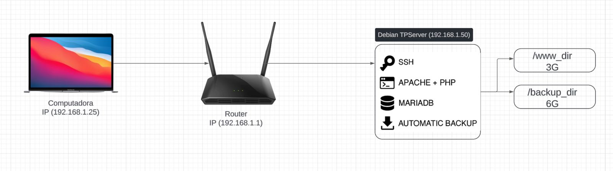

# PICA-PICA
# Proyecto TPServer - EQUIPO PICA PICA
**Participantes**:
- IVÁN ANDERSCH
- CARMEN NOEMI AGUIRRE
- CRISTIAN ALBUJA

**Descripción:**  
Implementación de servidor Debian con servicios SSH, Apache+PHP, MariaDB, respaldo automático y almacenamiento externo.

